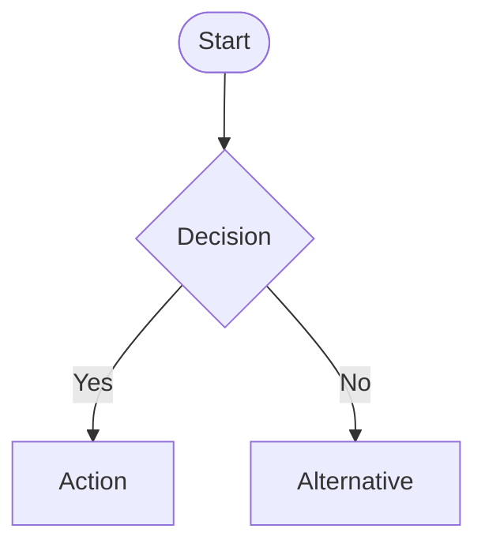

# Derek's Documentation Style Preferences

> **Summary:** Documentation guidelines derived from huloop-dev-tools and configuration-manager patterns. These preferences ensure consistent, professional, and highly usable technical documentation across all projects.

## 🏗️ Structure and Organization

### Hierarchical Structure
- **Use consistent heading hierarchy** with meaningful emoji prefixes
- **Start sections with quote block summaries** using `> **Summary:**` format
- **Include Table of Contents** for documents with 4+ major sections
- **Cross-reference related sections** using links and inheritance notes

### Emoji Usage for Visual Hierarchy
- 🚀 **Getting Started/Quick Start** - For immediate action sections
- 📋 **Lists/Documentation** - For structured information and procedures
- ⚠️ **Important Notes/Warnings** - For critical information
- ✅ **Success/Validation** - For positive outcomes and checkpoints
- 🔍 **Details/Advanced** - For in-depth explanations
- 🔐 **Security/Secrets** - For security-related content
- 🏗️ **Architecture/Structure** - For system design and organization
- 📜 **Configuration/Schema** - For configuration and data structures

## ✍️ Writing Patterns

### Quote Block Summaries
Use quote blocks to introduce complex sections:
```markdown
> **Summary:**
> Brief, 1-2 sentence explanation of what this section covers and why it matters.
```

### Feature Documentation
- **Lead with benefits** - explain what the feature does for the user
- **Use emoji bullets** (🔐, 🏗️, ✅) for feature lists
- **Provide concrete examples** for each major feature
- **Include edge cases and limitations**

### Technical Precision
- **Exact commands** with full parameters and expected outputs
- **Absolute file paths** when referencing specific locations
- **Version numbers** and compatibility information
- **Error messages** and troubleshooting steps

## 📊 Visual Elements

### Mermaid Diagrams
Use mermaid for:
- **System flows** and process diagrams
- **Architecture overviews** with component relationships
- **Build pipelines** and dependency chains
- **Decision trees** and workflow logic

```markdown


### Collapsible Sections
Use `<details>` for:
- **Code examples** that might be lengthy
- **Configuration samples**
- **Advanced usage** that might clutter main flow
- **Troubleshooting details**

```markdown
<details><summary>Example Configuration</summary>

```json
{
  "key": "value",
  "nested": {
    "example": true
  }
}
```

</details>
```

### Tables for Structured Data
- **Mapping tables** (commands to descriptions, files to purposes)
- **Configuration options** with defaults and descriptions
- **Comparison matrices** between different approaches
- **Status indicators** and validation results

## 📋 Content Organization

### Documentation Entry Points

#### 1. Quick Start Section
```markdown
## 🚀 Quick Start

> **Summary:** Get up and running in under 5 minutes with the most common use case.

1. **Prerequisites check:**
   ```bash
   command --version
   ```
2. **Installation:**
   ```bash
   install command
   ```
3. **Basic usage:**
   ```bash
   usage example
   ```
```

#### 2. Usage Modes
Clearly separate different ways to use the system:
- **CLI usage** with all modes and flags
- **Library/API usage** with code examples
- **Development workflow** integration
- **CI/CD integration** examples

#### 3. Configuration Documentation
- **Template files** with real-world examples
- **Field explanations** with types and constraints
- **Environment-specific** variations
- **Validation rules** and error handling

### Project Structure Documentation
Always include a project overview:
```markdown
## 📁 Project Structure

```
project/
├── src/
│   ├── main.py              # Entry point and CLI interface
│   ├── models/              # Data models and validation
│   └── utils/               # Utility functions
├── tests/                   # Test suites
├── docs/                    # Additional documentation
└── examples/                # Usage examples and templates
```
```

## 🔧 Code Documentation

### Command Examples
- **Show full command syntax** with all required parameters
- **Include expected output** or success indicators
- **Provide alternative approaches** for different scenarios
- **Reference related commands** and workflows

### Configuration Examples
- **Real-world scenarios** rather than abstract examples
- **Multiple environment types** (local, cloud, production)
- **Common customizations** and their use cases
- **Validation examples** showing both success and failure cases

### Error Handling Documentation
- **Common error messages** with explanations
- **Troubleshooting steps** in logical order
- **Workarounds** for known issues
- **When to contact support** vs. self-service

## 🚨 Special Considerations

### Security Documentation
- **Never include actual secrets** in examples
- **Use placeholder values** that clearly indicate their purpose
- **Explain secret management** approaches and best practices
- **Document access controls** and permission requirements

### Development Workflow Integration
- **Testing procedures** with exact commands
- **Build processes** including dependencies and outputs
- **Linting and formatting** requirements
- **Contribution guidelines** and code review process

### Maintenance and Updates
- **Version compatibility** information
- **Update procedures** with rollback options
- **Breaking change** documentation
- **Migration guides** between versions

---

## 📝 Template Structure

Use this structure for comprehensive documentation:

```markdown
# Project Name

> **Summary:** One-sentence description of what this does and why it matters.

## 🚀 Quick Start
[Immediate getting started steps]

## 📋 Table of Contents
[For longer documents]

## 🏗️ Architecture Overview
[High-level system design]

## ⚙️ Configuration
[Setup and configuration options]

## 📊 Usage Examples
[Common use cases and patterns]

## 🔍 Advanced Topics
[In-depth explanations and edge cases]

## 🚨 Troubleshooting
[Common issues and solutions]

## 🛠️ Development
[Contributing and development setup]
```

This template ensures comprehensive coverage while maintaining readability and usability.